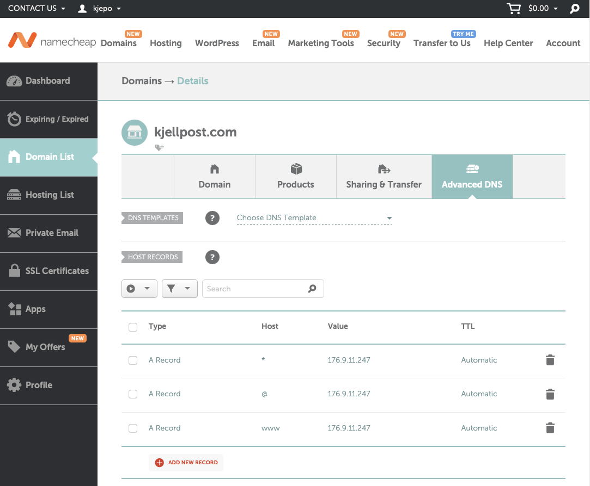

# How to setup a (wildcard) subdomain for your website

Let's say you have a website, e.g., `kjellpost.com`.
Now you want to create subdomains, e.g., `shop.kjellpost.com` and `blog.kjellpost.com`.

There are two steps involved in doing this.

## DNS settings

First you need to access your DNS settings at your domain name registrar.
I am showing what namecheap.com looks like here.



What I've done here is to create a record, set Host to `*` and let it point to the same IP-address
as the normal site `kjellpost.com`.  This creates a wildcard so that anyone looking up the name
`shop.kjellpost.com` or `blog.kjellpost.com` will get the same IP-address as `kjellpost.com`.

Note: It may take a few minutes, depending on your registrar, for this setting to work.

However, this is not enough.  On the server we also have to create a virtual host for these
subdomains.

## Virtual host
In the following description, we use Apache.  Other alternatives, e.g., NGINX use similar
techniques but virtual host files are called Server blocks.

The Apache server, when given a question "Do you have anything for `kjellpost.com`?", looks for
a virtual host file `kjellpost.com.conf`. This file tells the web server where to look
for the HTML/PHP files it needs to serve to the user:

```
<VirtualHost *:80>
 ServerName kjellpost.com
 DocumentRoot /var/www/kjellpost/
 ...
</VirtualHost>
```

In this example, the HTML/PHP files are stored in the directory `/var/www/kjellpost/`.

In order to accomodate the subdomains, we add a line with the keyword `ServerAlias`:

```
<VirtualHost *:80>
 ServerName kjellpost.com
 ServerAlias *.kjellpost.com
 DocumentRoot /var/www/kjellpost/
 ...
</VirtualHost>
```

In order to get this running, we must first enable the site:

```
sudo a2ensite kjellpost.com.conf
```

and then restart Apache:

```
sudo service apache2 restart
```

Now a request for, e.g., `shop.kjellpost.com` will also be handled like `kjellpost.com`.

## Testing

We can test this setup by writing a small PHP script that tells us the server name:

```
<?php
echo "SERVER_NAME: " . $_SERVER['SERVER_NAME'] . "<br>";
?>
```

If you enter `shop.kjellpost.com/readme.php` it will display `SERVER_NAME: shop.kjellpost.com`.

If you enter `xyzzy.kjellpost.com/readme.php` it will display `SERVER_NAME: xyzzy.kjellpost.com`.

It is then up to you decide what your PHP script should do, based on the server name.


